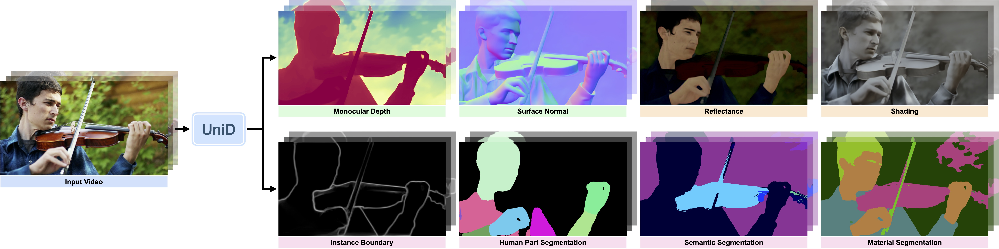

# Unified Video Dense Prediction from Disjoint Data

### [Project Page](https://unid-video.github.io/) | [Paper](https://github.com/YihongSun/UniD)

Official PyTorch implementation for the ECCV 2026 paper: "Unified Video Dense Prediction from Disjoint Data".

## Code Release TBA